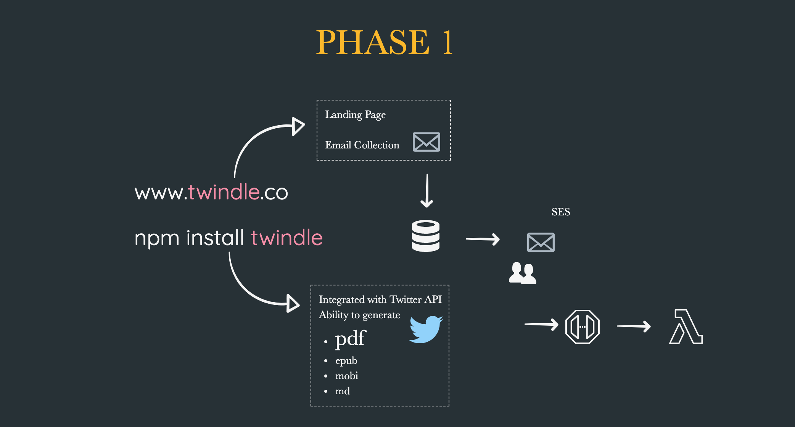
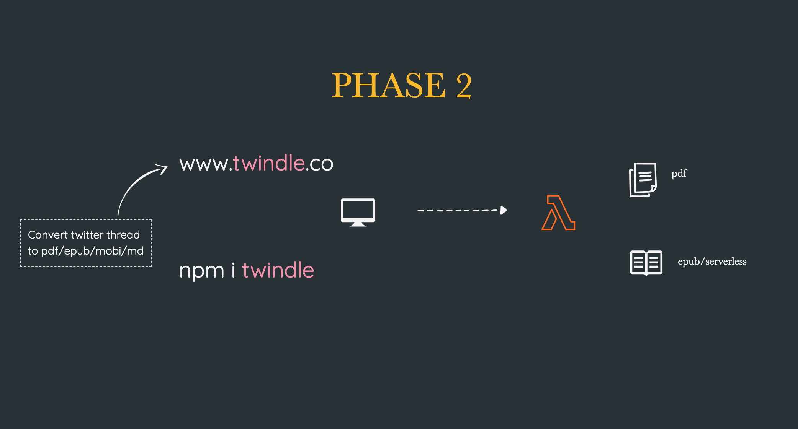

# [Twindle](https://twindle-co.github.io/twindle/.) 📖

> ### An open source project for beginners.
> ### Converting twitter threads to pdf, epub and mobi format to be read by Kindle.

 

## What is Twindle? 🤔

Twindle (Twitter + Kindle = Twindle) is an open source project made for the purpose of converting long Twitter threads into ePub's or PDF documents to allow users to read longscroll threads on a kindle or as a PDF on their device of choice.

## Articles

- [Joined Twindle. What next?](./docs/ONBOARDING.md)
- [FAQ](./docs/FAQ.md)
- [Resources](./docs/RESOURCES.md)
- [How to create your first pull request](./docs/articles/creating-first-pull-request.md)
- [Handlebar Explained](./docs/articles/handlebar-explained.md)
- [Puppeteer Explained](./docs/articles/puppeteer-explained.md)
- [How to sync to the main repo](./docs/articles/sync-to-main-repo.md)

## Twindle - high level design (DRAFT)

### Roadmap 🛣

- [ ] In depth detail roadmap discussion
- [ ] Node.js CLI
- [ ] A webpage providing the same services
- [ ] Converting blogs from sites such as Hashnode and Medium
- [ ] Browser Extension with similiar functionality

## Want to contribute on twindle.co home page design

Pre-requsites

- HTML
- CSS

Initial code goes into twindle-web

## Want to contribute on twindle cli (phase 1 application)

Pre-requsites

- JavaScript
- Node.js (basic)

Initial code goes into twindle-cli

## Languages & Tools

 
 

---

### 📺 Latest YouTube Videos

<!-- YOUTUBE:START -->
- [Twindle PDF Rendering](https://www.youtube.com/watch?v=3WdxnAOTZq0)
- [Svelte Overview and Discussion](https://www.youtube.com/watch?v=tp5lYJdJ1XE)
- [Twindle Hacker News Integration](https://www.youtube.com/watch?v=kX4ejOw46Vg)
- [Twindle Thread Bookmark & Management](https://www.youtube.com/watch?v=yKL-6QXKQMw)
- [Twindle Github as source](https://www.youtube.com/watch?v=2SyHZglZZFo)
<!-- YOUTUBE:END -->

➡️ [more videos...](https://www.youtube.com/channel/UCKxUmbHq5P5pd5IyUiZ8MHA/videos)

---

## Daily Meeting Mon-Fri (5 PM IST) (No meeting on Sat & Sun)

[Google Meet Link](https://meet.google.com/gna-hvym-tfj) - [Time Zone Converter](https://time.is/compare/1700_in_IST)

## Connect with us

