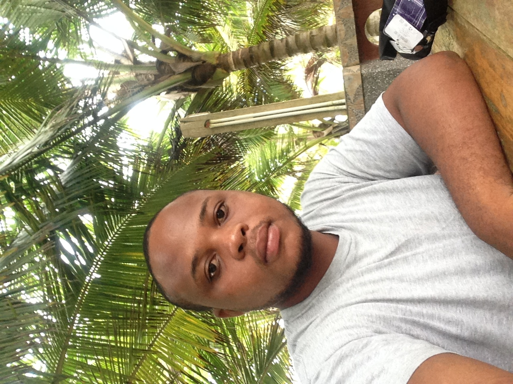
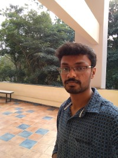

## Beginner

| Image                                                                                    | Name                                                         | Description                                                                                                                                                                                                                                                                                                                                                                                                |
| ---------------------------------------------------------------------------------------- | ------------------------------------------------------------ | ---------------------------------------------------------------------------------------------------------------------------------------------------------------------------------------------------------------------------------------------------------------------------------------------------------------------------------------------------------------------------------------------------------- |
|                         | [Pranav Goel](https://github.com/pranavgoel29)               | I'm from India, Have basic knowledge of HTML, CSS, C++ and C, I'm currently learning Javascript.                                                                                                                                                                                                                                                                                                           |
|                                                                                          | [Adewale Abiola](https://github.com/princehaybee)            | I am a Nigerian. I have basic knowledge of HTML,CSS and Javascript.                                                                                                                                                                                                                                                                                                                                        |
|                         | [Micheal Aderinto](https://github.com/ad3rinto)              | Manchester UK, Hoping this will be my first step in the world of solving world problems with code.                                                                                                                                                                                                                                                                                                         |
|                                                                                          | Usha Kiran ([K!r@nD0n](https://twitter.com/ushakiran_m))     | I am a student from India. I just started my OpenSource journey with TWINDLE. I am currently learning #JavaScript.                                                                                                                                                                                                                                                                                         |
|                            | [Eyram ](https://twitter.com/Ey_kwasi)                       | I am from Ghana and I have no experience, started learning web development some months ago. I am participating to learn and also make twindle a success.                                                                                                                                                                                                                                                   |
|                                                                                          | [Michael Osajeh](https://github.com/michaelcosj)             | I am from Lagos, Nigeria, second year Computer Science Undergraduate, started learning web and mobile development this year. I have basic knowledge of javascript, python, c++, dart and golang.                                                                                                                                                                                                                                                                           |
|                                                                                          | [Tushar Kandpal](https://github.com/tusharkandpal)           | From India, Contributing in making **twindle** a succees, Always a Learner :v:                                                                                                                                                                                                                                                                                                                             |
|  | [Rafael Rodrigues](https://github.com/RafaelBatman55)        | Less than 1 yr of experience From small city in Rio de Janeiro State - Braz.I'm very excited to learn and helf in this project!                                                                                                                                                                                                                                                                            |
|                                                                                          | [Yaksh Bariya](https://www.github.com/thunder-coding)        | I am from India. A 14 year old technology lover. I create amazing things using the knowledge I have gained so far. Currently, I want to explore more of JavaScript/TypeScript.                                                                                                                                                                                                                             |
|                                                                                          | [Nishank Navelkar](https://www.github.com/nishanknavelkar)   | Im from India, Basic knoweledge of Python, C, C++, HTML, CSS, Electrical engineer, Here to learn and Contribute.                                                                                                                                                                                                                                                                                           |
|                                                                                          | [Manohar Rajaram](https://github.com/manohar52)              | I am from India but currently pursuing my Masters in computer science in US. I am quite new to Javascript. I have some experience in HTML, CSS and PHP.                                                                                                                                                                                                                                                    |
|                                                                                          | [Naveen Kala](https://github.com/naveenkala)                 | I'm an engineering student from India. Having basic knowledge of HTML, CSS and JavaScript. Currently I am learning Reactjs.                                                                                                                                                                                                                                                                                |
|                                                                                          | [Alasi Habeeb](https://github.com/Holaryeankar007)           | I'm from Nigeria, I have experience in HTML and CSS but i'm currently learning Javascript.                                                                                                                                                                                                                                                                                                                 |
|                                                                                          | [Sheetal Pandey](https://github.com/Sheetal777)              | A keen learner from India pursuing engineering. Good with Python but new to Web Developement.                                                                                                                                                                                                                                                                                                              |
|                            | [Regina Gachomba](https://github.com/MumbiGachomba04)        | I am a Kenyan undergraduate student currently based in Ankara, Turkey. During my first year in college I learnt C,C++ and python. I am currently learning Java OOP for my coursework and teaching myself HTML,CSS and Javascript. Looking forward to master front-end development at the moment, then hopefully I can begin learning back-end.                                                             |
|                                                                                          | [Swati Rao](https://github.com/SwatiRaoDataEnthusiast)       | I am from India,I am familiar with HTML,CSS and can learn Node.JS, javascript etc. This is the my first open source project TWINDLE. Really excited!!                                                                                                                                                                                                                                                      |
|                                                                                          | [Prathap](https://github.com/codeprm)                        | From India. Newbie to UI tech. CS Student, 4+ exp.                                                                                                                                                                                                                                                                                                                                                         |
|                                           | [Fabio Duarte](https://github.com/lh536)                     | I am from Colombia. I have some experience with HTML, CSS and JavaScript. Lately I've been learning Tailwindcss, ParcelJS, NodeJS and a first lesson of VueJS. I like listen to music (play guitar and drums), airplanes, cooking, video/photography and science; actually I'm biologist, but I love coding since I was in the school. I hope I can contribute to twindle. I'm always learning.            |
|                                                                                          | [Nahuel Alfano](https://github.com/NahuelAlfano)             | I am from Argentina, beginner at github and open source projects. I have basic knowledge of HTML, CSS, Javascript, C#, C++, currently learning Python.                                                                                                                                                                                                                                                     |
|                                                                                          | [Tr0mbley](https://github.com/tr0mbl3y)                      | learning how things works! nothing to share much                                                                                                                                                                                                                                                                                                                                                           |
|                                                                                          | [Sippeybro](https://github.com/sippeybro)                    | I'm from Maldives, Have basic knowledge of HTML, CSS, php and I'm currently learning Javascript.                                                                                                                                                                                                                                                                                                           |
|                                                                                          | [Titi Olopade](https://github.com/teckiegeek)                | I am from the United Kingdom. My background is Computing and Statistics with a MSc. in Agile Project Management and PRINCE2 certified,i SCRUM Master Certified. I have several years professional experience with few years career break. I started learning HTML and CSS coding 6months ago. I plan a change in career to be a Front-end developer. Here to learn and contribute to success of "twindle". |
|                                                                                          | [luli](https://github.com/ululi)                             | I'm from zambia,have some basic knowledge of html, css and js, am here to learn more about web development.                                                                                                                                                                                                                                                                                                |
|                                                                                          | [Ashish](https://github.com/kambleaa007)                     | 3+ yr of experience in .Net Java JavaScript Testing, Pune, India SoReady2Help :partying_face:                                                                                                                                                                                                                                                                                                            |
|                             | [Nneyen ](https://github.com/Na-ilah)                        | I am from Nigeria. I am beginner at github and open source projects. I have basic knowlege of Python, HTML and CSS. I don't remember much about programming even if I have a degree in computing. I would like to be able to contribute to the open source community and build educational solutions.                                                                                                                                                                              |
|                                                                                          | [Harsha Vardhan](https://github.com/Harsha-Ambati)           | I am a student from India, recently came into this web development field, had basic knowledge in HTML, CSS, JavaScript.                                                                                                                                                                                                                                                                                    |
|                                                                                          | [Maria Rivera](https://github.com/GorettiRivera)             | I have basic knowledge of Javascript, HTML and CSS. Currently working in different open source projects                                                                                                                                                                                                                                                                                                    |
|                                                                                          | [Neaz Mahmood](https://github.com/Neaz-Mahmood)              | I am from Dhaka, Bangladesh. I am a second year Computer Science undergraduate. I know basic html, css, javascript. I am here to learn & contribute to 'twindle'. This is my first open source project.                                                                                                                                                                                                    |
|                                                                                          | [Predrag](https://github.com/stamenkovic-dev)                | I'm from Serbia, and I have only basic knowledge of HTML and CSS, but I'm here to learn more about web development and team play at coding.                                                                                                                                                                                                                                                                |
|                                                                                          | [Franklin U.O. Ohaegbulam](https://github.com/frankiefab100) | I'm comfortable working with HTML and CSS, with basic knowledge of JavaScript. I'm from Nigeria and love talking about accessibility, inclusive design and web animation.                                                                                                                                                                                                                                  |
|                                                                                          | [Aravind Sivasailam](https://github.com/aravindsivasailam)   | I'm a product engineer living in US with 2 years of experience in software testing and project management. New to software development and wish to improve in HTML, CSS and JS.                                                                                                                                                                                                                            |
|                                                                                          | [Edwin Mancipe](https://github.com/efmg0325)                 | I am from Colombia. I have a bit of knowledge about HTML, CSS, Javascript, Python and SQL. I love to listeninng to Heavy Metal music. I like second life web browser games.                                                                                                                                                                                                                                |
|                                                                                          | [Edori Atiri](https://github.com/EdoriAtiri)                 | From Nigeria. Began to learn Web Development this year. I hope to learn and contribute while I'm here.                                                                                                                                                                                                                                                                                                     |
|                                                                                          | [Lorenna Leon](https://github.com/lorennaleon)               | I am Peruvian, I have knowledge in html, css and javascripts I hope to learn a lot from you                                                                                                                                                                                                                                                                                                                |
|  | [Fusen Ye](https://github.com/Yexiansen66)                   | I'm a beginner from China. I know HTML,CSS and JavaScript.I want to learn more advanced knowledge and contribute to twindle.                                                                                                                                                                                                                                                                               |
| | [OmoloG](https://github.com/geowen74) | From Nairobi, Kenya. Have Knowledge on HTML, CSS and some basic on javascript and Mysql. Aspiring to be a full-stack developer. Currently learning javascript.
|  | [Shekhar Ranjan](https://github.com/shekhar10feb)                   | I'm from India, have basic knowledge of Java, SQL, HTML, CSS and still learning JavaScript, want to learn more and explore advance stuffs.|

---

 

## Intermediate

| Image | Name                                 | Description      |
| --------------- | -------------------------------------------- | ---------------- |
| | [Tolga Erdönmez](https://github.com/tolgaerdonmez) | I'm from Turkey. I'm a student. I've been programming for 4 years but no proffessional experience.                                                                                                                                                                                                                          |
| | [Ameen](https://github.com/UnevenCoder)            | 3+ yrs of experience ,From India , born & brought up in Jeddah [ I am 15 yrs old :)], An Extrovert & A Feeler :)                                                                                                                                                                                                            |
| | [Krypton](https://github.com/madhusudanbabar)      | I'm an engineering student from India, passionate for web technologies, especially nuxtJS. I love blogging (technical articles & CTF walkthroughs mostly as I'm also interested in cyber security).                                                                                                                         |
| | [Rakesh](https://github.com/Rakesh-4)              | Software Developer have 3+ years of experience in C#, JavaScript and Angular Framework                                                                                                                                                                                                                                      |
| | [Samriddhi](https://github.com/sammjainn)          | I'm a student from India. Here to learn and work together!                                                                                                                                                                                                                                                                  |
|   | [PraveenKumar](https://github.com/praveen2896)     | I'm from India, having 3 years of professional experience in Backend, new to JS,HTML,CSS ,Planning to learn React in future with the help of #twindle.                                                                                                                                                                      |
|  | [Vipin Rawat](https://github.com/aesthytik)        | I'm a frontend Engineer from Punjab,India. 2+ years experience in React Native and React js. I create Logos and graphics for fun.Happy to help :)                                                                                                                                                                           |
|  | [Satyaki Bose](https://github.com/satyaki07)       | I'm a newbie in MERN stack from Kolkata, India with 1+ years of experience. :)                                                                                                                                                                                                                                              |
|  | [Aparna Sivasailam](https://github.com/Mira-Alf)   | I'm from Bengaluru, India. Tech woman on a career break with 6 years of Java Experience. Trying to upskill myself with Javascript and UI/UX design                                                                                                                                                                          |
| | [Rajesh](https://github.com/rkumar1904)            | I'm a Lead frontend developer from Mumbai, India. Total 9+ years experience in front end technology. Currently working on ReactJS & Flutter. Initially, I started my career as a Programming Faculty.                                                                                                                       |
| | [Sunny](https://github.com/SunnyDev7)              | I am Sunny from India and a engineering student. And i am working on MERN stack and also comfortable with html, css and vanilla js and am Here to learn, collaborate and help.                                                                                                                                              |
|  | [Akshay Sharma](https://github.com/Akshay2996)     | I'm a Frontend Developer from Bangalore, India. Total 1+ years of experience in the industry. Contributing to Twindle to make it successful.                                                                                                                                                                                |
| | [Karan Parsnani](https://github.com/LilFatFrank)   | From Mumbai, India. Here to learn and contribute.                                                                                                                                                                                                                                                                           |
| | [Lukman Okunade](https://github.com/lokunade)      | From Lagos, Nigeria. I am joining the twindle open source to learn and contribute.                                                                                                                                                                                                                                          |
| | [krishnadevz](https://github.com/lokunade)         | I am krishna 4 years of expereince in web-development Current skills(HTML/CSS/JS/REACTJS/C/bootstrap4) from india currrently i am final year CS gradd student and Learning MERN✡ Stack Developer SelfTaught-Dev/Opensourcer🛠 #100DaysOfCode(R2) FOSS❤ I like to build things & Write things related to Web🌐⚙ #webdev 🐱‍💻 |
| | [Melissa Huerta](https://github.com/piratelicorne) | Hi! I'm Systems Engineer from Perú, 3+ yrs of experience in IT Infrastructure, I have knowledge in C and Javascript. I recently started in Development as Flutter Developer, currently working on side projects 👩🏽‍💻 and blogging for #WomenWhoCodeSV                                                                         |
| | [Abdou Masoudi](https://github.com/uplancer)       | a selft-taught Web Developer.|
| | [Viraj](https://github.com/viraj-patil)            | I'm a full stack developer from Pune, India. Total 9+ years of experience in software industry as a developer. |
|  | [Joel Vinay Kumar](https://github.com/JoelVinayKumar)     | I'm a FullStack Developer from Hyderabad, India. Worked on building microservices, web apps and mobile apps. I learned UI design out of passion. I'm proud of any small contribution to Twindle|
|  | [Saurabh Srivastava](https://github.com/vasudeveloper001) | From India, 18 months Software Development Experience mainly in backend PHP development. Know about JavaScript, HTML, CSS, Nodejs, Python basics as well. Learning JAVA currently and starting a YouTube Channel on coding. |
|  | [Nitin Kadam](https://github.com/ni3-kdm)            | Full stack developer from Pune, India. 5+ years of experience in the web development 👩🏽‍💻. |
|   | [Marcus](https://github.com/mar-code)              | I'm a self taught frontend developer from Lagos, Nigeria with experience in HTML/CSS, Javascript, React, Redux, bootstrap and d3 data presentation. i am currently learning NodeJs|
| | [Samuel Adeniyi](https://github.com/samueladeniyi) | I am proficient in HTML, CSS and Javascript. I am comfortable with react. I intend to become a fullstack developer with the MERN stack. I am from Nigeria |
---

 

## Mentor

| Image                                                           | Name                                          | Description                                                                                        |
| --------------------------------------------------------------- | --------------------------------------------- | -------------------------------------------------------------------------------------------------- |
|  | [Proful](https://github.com/proful)           | 15 yr of experience From India, Living in Sydney Actively participating to make twindle a success. |
|         | Kenny John Jacob                              | 4+ yrs of experience. From Kerala, India. Here to help :partying_face:                             |
|                                                                 | Kingsley                                      | 3+ yrs of experience. Based in Nigeria and here to help :man_technologist:                         |
|                                                                 | [Pratham](https://github.com/prasoonpratham)  | 2+ experience in JavaScript, always open to help :smile:                                           |
|                                                                 | [Sarath](http://http://www.sarathnagaraj.ca/) | 6+ experience in JavaScript, Currently working on a side project using ReactJS :man_technologist:  |