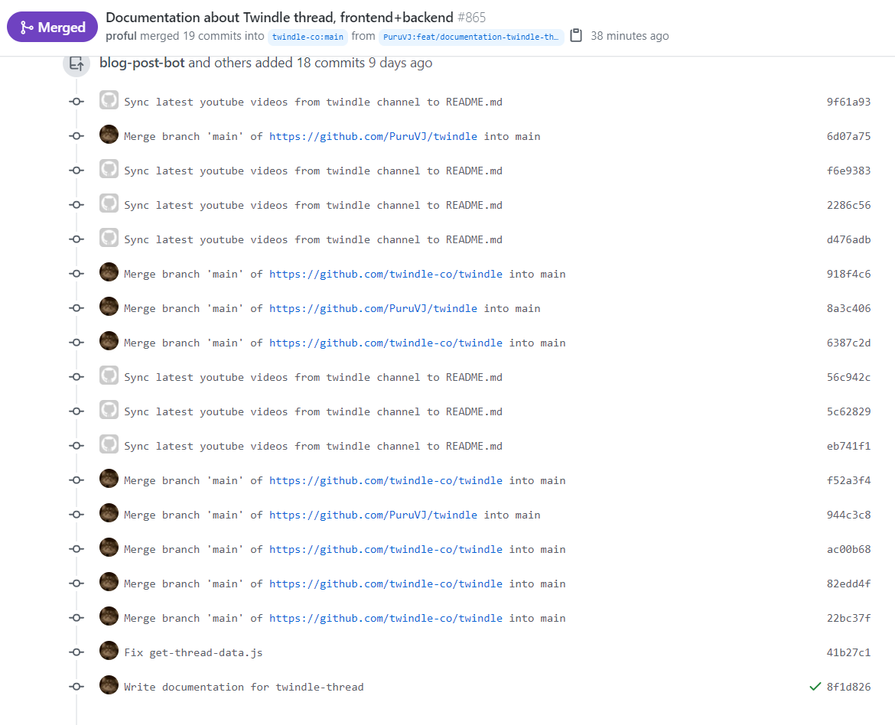

Take a look at the image below


It's a PR I opened recently. I made only 2 commits related to this PR, but as you can see, this includes a lot of commits (19 to be exact). The thing is that it was 15 commits in the previous PR, and around 13 in the one before. As you can see, these commits are just adding on. The next PR I make would have all these included plus the new commits.

So, how do you make these disappear?

Read on!

# Why does it happen?

It happens primarily when you make a PR from your `main` branch, or just push commits from it.

A word:

> Never push changes from main. Your `main` exists only to sync latest changes from the upstream branch. Always make a new branch, edit code there, and make the PR from that branch only.

# Yeah, but tell me how to get rid of those stowaway commits!

Right! All you have to do is run these commands

```bash
git checkout main
git reset --hard upstream/main
git push --force
```

These above should do it. But remember! You shouldn't have any changes in your working repo, as they might get deleted. Better make a new branch, then go back to `main` and run these commands then.
